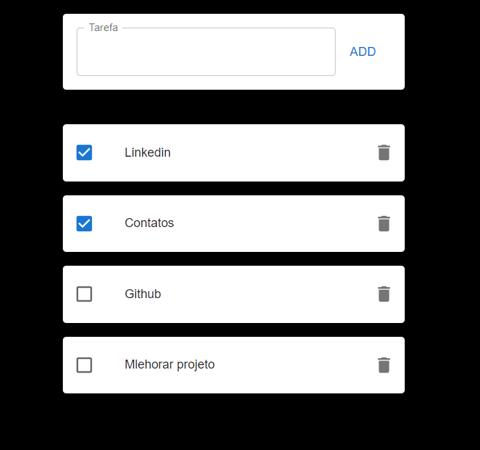

Lista de tarefas criado com React.

O Projeto consiste em criar uma TodoList, para facilitar as tarefas do dia a dia, em que o usuário acrescenta as tarefas a serem realizadas e após cumpridas, consegue marca-las com feitas ou exclui-las.

Foi utilizado o Framework React.Js

